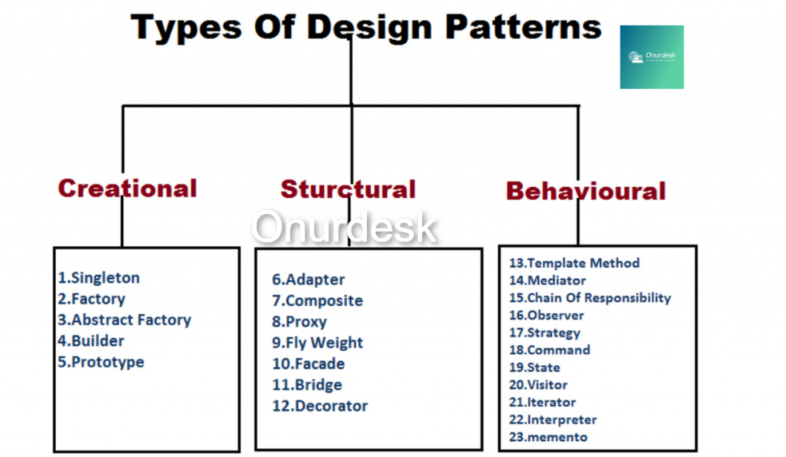

## What Is a Design Pattern?

A design pattern is a general reusable solution to a commonly occurring problem within a given context which implies the following. Programmers often encounter the same problem repeatedly and use a best practice type that has been documented and proven to work. A design pattern represents an idea, and we should write an implementation for that pattern and implement that in our code.

### Design pattern types 

Design patterns can be broadly categorized into three types: **creational**, **structural**, and **behavioral** patterns. 

1. **Creational Patterns**: Focus on the process of object creation, ensuring flexibility and reuse.
    - **Example**: _Singleton Pattern_ - restricts a class to a single instance, useful for managing shared resources.
2. **Structural Patterns**: Deal with the composition of classes or objects, simplifying relationships.
    - **Example**: _Adapter Pattern_ - allows incompatible interfaces to work together, like converting a new interface to be compatible with an existing one.
3. **Behavioral Patterns**: Address how objects interact and communicate, focusing on algorithms and the assignment of responsibilities.
    - **Example**: _Observer Pattern_ - defines a one-to-many relationship where changes in one object (subject) notify all dependent objects (observers), useful for event-driven systems.

|Example: Traffic Project|Design Pattern Type|Explanation|
|---|---|---|
|Create instance of `Led` object|Creational Patterns|This involves creating objects to represent individual LEDs, which can be used in the system.|
|Create instance of `Button` object|Creational Patterns|Creating an object for a button is also part of managing how components of the project are instantiated.|
|Create `Light_Traffic` class containing 3 instances of `Led`|Structural Patterns|This represents the composition where `Light_Traffic` aggregates multiple `Led` objects to build a more complex structure.|
|Handling event when button pressed to start traffic light system|Behavioral Patterns|This manages how objects interact — specifically how the button press event triggers a response to control the LEDs.|

**Explanation of Design Patterns Used:**

1. **Creational Patterns**: Here, creating instances of `Led` and `Button` involves defining how objects are instantiated, which ensures consistency and flexibility.
    
2. **Structural Patterns**: The `Light_Traffic` class, containing multiple instances of `Led`, reflects a structural relationship, combining simple objects to build more complex functionality.
    
3. **Behavioral Patterns**: Handling the button press event to control the traffic light represents how objects communicate and behave, defining the logic flow of events in the system.

