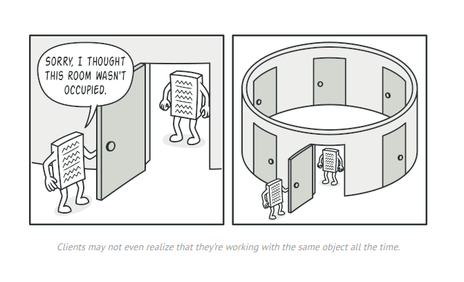

**Singleton** is a creational design pattern that lets you ensure that a class has only one instance, while providing a global access point to this instance.

the figure show the Singleton Concept design pattern **One Instance** and **Global Access**

## Problem

The Singleton pattern solves two problems at the same time, violating the _Single Responsibility Principle_:

1. **Ensure that a class has just a single instance**.Why would anyone want to control how many instances a class has? The most common reason for this is to control access to some shared resource—for example, a database or a file.
2. **Provide a global access point to that instance**.

- On the left, a regular class is shown with multiple objects being instantiated by different clients.
- On the right, a Singleton class is shown, with different clients accessing the same single instance, highlighting how it restricts object creation.

## Solution
All implementations of the Singleton have these two steps in common:

- Make the default constructor private, to prevent other objects from using the `new` operator with the Singleton class.
- Create a static creation method that acts as a constructor. Under the hood, this method calls the private constructor to create an object and saves it in a static field. All following calls to this method return the cached object.
## Structure

The **Singleton** class declares the static method `getInstance` that returns the same instance of its own class.

The Singleton’s constructor should be hidden from the client code. Calling the `getInstance` method should be the only way of getting the Singleton object.

## Applicability
1-Use the Singleton pattern when a class in your program should have just a single instance available to all clients; for example, a single database object shared by different parts of the program.
	The Singleton pattern disables all other means of creating objects of a class except for the special creation method. This method either creates a new object or returns an existing one if it has already been created.
3-Use the Singleton pattern when you need stricter control over global variables.
	Unlike global variables, the Singleton pattern guarantees that there’s just one instance of a class. Nothing, except for the Singleton class itself, can replace the cached instance.

Note that you can always adjust this limitation and allow creating any number of Singleton instances. The only piece of code that needs changing is the body of the `getInstance` method.

