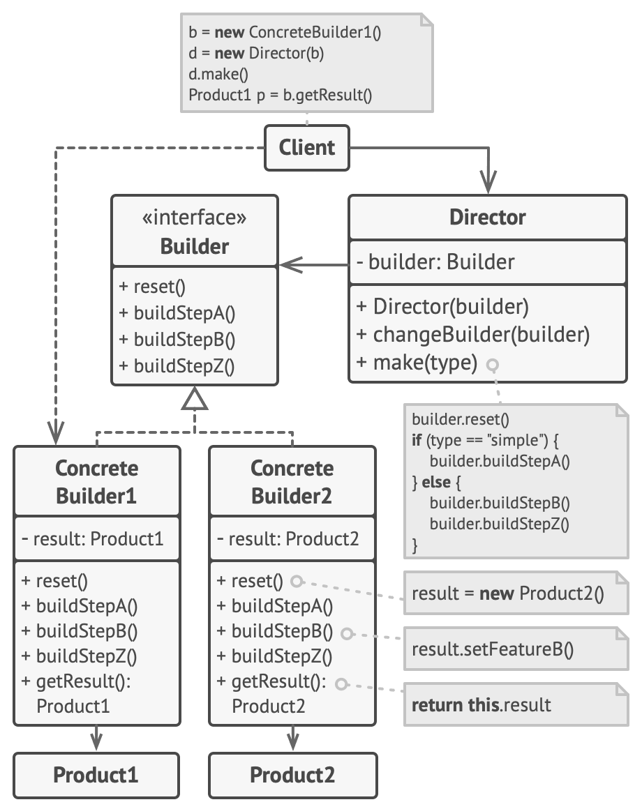

**Builder** is a creational design pattern that lets you construct complex objects step by step. The pattern allows you to produce different types and representations of an object using the same construction code.

## Problem

Imagine a complex object that requires laborious, step-by-step initialization of many fields and nested objects. Such initialization code is usually buried inside a monstrous constructor with lots of parameters. Or even worse: scattered all over the client code.

You might make the program too complex by creating a subclass for every possible configuration of an object.

The constructor with lots of parameters has its downside: not all the parameters are needed at all times.
In most cases most of the parameters will be unused, making [the constructor calls pretty ugly](https://refactoring.guru/smells/long-parameter-list). For instance, only a fraction of houses have swimming pools, so the parameters related to swimming pools will be useless nine times out of ten.

## Solution

The Builder pattern suggests that you extract the object construction code out of its own class and move it to separate objects called _builders_.

The Builder pattern lets you construct complex objects step by step. The Builder doesn’t allow other objects to access the product while it’s being built.

Some of the construction steps might require different implementation when you need to build various representations of the product. For example, walls of a cabin may be built of wood, but the castle walls must be built with stone.

In this case, you can create several different builder classes that implement the same set of building steps, but in a different manner. Then you can use these builders in the construction process (i.e., an ordered set of calls to the building steps) to produce different kinds of objects.

For example, imagine a builder that builds everything from wood and glass, a second one that builds everything with stone and iron and a third one that uses gold and diamonds. By calling the same set of steps, you get a regular house from the first builder, a small castle from the second and a palace from the third. However, this would only work if the client code that calls the building steps is able to interact with builders using a common interface.

#### Director

You can go further and extract a series of calls to the builder steps you use to construct a product into a separate class called _director_. The director class defines the order in which to execute the building steps, while the builder provides the implementation for those steps.

Having a director class in your program isn’t strictly necessary. You can always call the building steps in a specific order directly from the client code. However, the director class might be a good place to put various construction routines so you can reuse them across your program.

In addition, the director class completely hides the details of product construction from the client code. The client only needs to associate a builder with a director, launch the construction with the director, and get the result from the builder.

## Structure

1-The **Builder** interface declares product construction steps that are common to all types of builders.
2-**Concrete Builders** provide different implementations of the construction steps. Concrete builders may produce products that don’t follow the common interface.
3-**Products** are resulting objects. Products constructed by different builders don’t have to belong to the same class hierarchy or interface.
4-The **Director** class defines the order in which to call construction steps, so you can create and reuse specific configurations of products.
5-The **Client** must associate one of the builder objects with the director. Usually, it’s done just once, via parameters of the director’s constructor. Then the director uses that builder object for all further construction. However, there’s an alternative approach for when the client passes the builder object to the production method of the director. In this case, you can use a different builder each time you produce something with the director.
