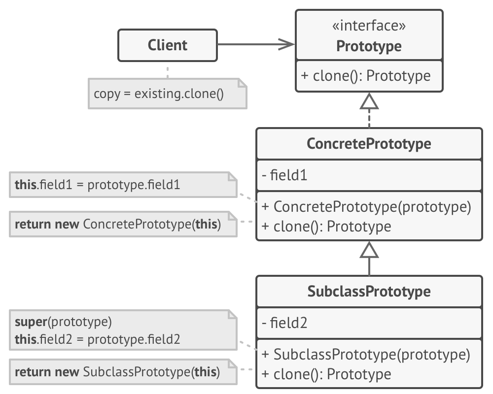

**Prototype** is a creational design pattern that lets you copy existing objects without making your code dependent on their classes.

## Problem
Say you have an object, and you want to create an exact copy of it. How would you do it? First, you have to create a new object of the same class. Then you have to go through all the fields of the original object and copy their values over to the new object.

Nice! But there’s a catch. Not all objects can be copied that way because some of the object’s fields may be private and not visible from outside of the object itself.

## Solution
The Prototype pattern delegates the cloning process to the actual objects that are being cloned. The pattern declares a common interface for all objects that support cloning. This interface lets you clone an object without coupling your code to the class of that object. Usually, such an interface contains just a single `clone` method.
The implementation of the `clone` method is very similar in all classes. The method creates an object of the current class and carries over all of the field values of the old object into the new one. You can even copy private fields because most programming languages let objects access private fields of other objects that belong to the same class.
An object that supports cloning is called a _prototype_. When your objects have dozens of fields and hundreds of possible configurations, cloning them might serve as an alternative to subclassing.


## Structure


1-The **Prototype** interface declares the cloning methods. In most cases, it’s a single `clone` method.
2-The **Concrete Prototype** class implements the cloning method. In addition to copying the original object’s data to the clone, this method may also handle some edge cases of the cloning process related to cloning linked objects, untangling recursive dependencies, etc.
3-The **Client** can produce a copy of any object that follows the prototype interface.


### Step 1: Define an Abstract Base Class

We start our implementation by defining an abstract base class, _****Shape****_, which serves as the prototype for all geometric shapes. It declares two essential virtual functions:
```c++
class Shape {
public:
	virtual Shape* clone() const = 0; // Clone method for creating copies.
	virtual void draw() const = 0; // Draw method for rendering the shape.
	virtual ~Shape() {}			 // Virtual destructor for proper cleanup.
};
```
The ****clone()**** method allows us to create copies of shapes, and ****draw()**** is responsible for rendering them. The virtual destructor ensures proper memory cleanup.

### Step 2: Create Concrete Prototype Classes

Now, we define concrete classes (classes that can be instantiated, meaning you can create objects (instances) of those classes) that inherit from our abstract base class _****Circle****_ and _****Rectangle.****_ These classes implement the ****clone()**** and ****draw()**** methods for their respective shapes.

#### Circle Prototype:
```c++
class Circle : public Shape {
private:
	double radius;

public:
	Circle(double r) : radius(r) {}

	Shape* clone() const override {
		return new Circle(*this);
	}

	void draw() const override {
		std::cout << "Drawing a circle with radius " << radius << std::endl;
	}
};

```
#### Rectangle Prototype:
```c++
class Rectangle : public Shape {
private:
	double width;
	double height;

public:
	Rectangle(double w, double h) : width(w), height(h) {}

	Shape* clone() const override {
		return new Rectangle(*this);
	}

	void draw() const override {
		std::cout << "Drawing a rectangle with width " << width << " and height " << height << std::endl;
	}
};

```
These concrete classes encapsulate the unique characteristics of circles and rectangles while adhering to the prototype structure.

### Step 3: Create and Use Shape Instances
```c++
Circle circlePrototype(5.0);
Rectangle rectanglePrototype(4.0, 6.0);
```
- We then clone these prototypes to create new shpaes:
```c++
Shape* shape1 = circlePrototype.clone();
Shape* shape2 = rectanglePrototype.clone();
```

```c++
shape1->draw(); // Output: Drawing a circle with radius 5
shape2->draw(); // Output: Drawing a rectangle with width 4 and height 6
```