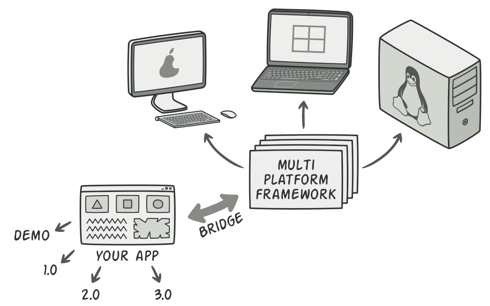

**Bridge** is a structural design pattern that lets you split a large class or a set of closely related classes into two separate hierarchies—abstraction and implementation—which can be developed independently of each other.

When talking about real applications, the abstraction can be represented by a graphical user interface (GUI), and the implementation could be the underlying operating system code (API) which the GUI layer calls in response to user interactions.

Generally speaking, you can extend such an app in two independent directions:

- Have several different GUIs (for instance, tailored for regular customers or admins).
- Support several different APIs (for example, to be able to launch the app under Windows, Linux, and macOS).

In a worst-case scenario, this app might look like a giant spaghetti bowl, where hundreds of conditionals connect different types of GUI with various APIs all over the code.

Making even a simple change to a monolithic codebase is pretty hard because you must understand the _entire thing_ very well. Making changes to smaller, well-defined modules is much easier.

You can bring order to this chaos by extracting the code related to specific interface-platform combinations into separate classes. However, soon you’ll discover that there are _lots_ of these classes. The class hierarchy will grow exponentially because adding a new GUI or supporting a different API would require creating more and more classes.

Let’s try to solve this issue with the Bridge pattern. It suggests that we divide the classes into two hierarchies:

- Abstraction: the GUI layer of the app.
- Implementation: the operating systems’ APIs.

The abstraction object controls the appearance of the app, delegating the actual work to the linked implementation object. Different implementations are interchangeable as long as they follow a common interface, enabling the same GUI to work under Windows and Linux.

As a result, you can change the GUI classes without touching the API-related classes. Moreover, adding support for another operating system only requires creating a subclass in the implementation hierarchy.

## Structure
1-The **Abstraction** provides high-level control logic. It relies on the implementation object to do the actual low-level work.
2-The **Implementation** declares the interface that’s common for all concrete implementations. An abstraction can only communicate with an implementation object via methods that are declared here.
The abstraction may list the same methods as the implementation, but usually the abstraction declares some complex behaviors that rely on a wide variety of primitive operations declared by the implementation.
3-**Concrete Implementations** contain platform-specific code.
4-**Refined Abstractions** provide variants of control logic. Like their parent, they work with different implementations via the general implementation interface.
5-Usually, the **Client** is only interested in working with the abstraction. However, it’s the client’s job to link the abstraction object with one of the implementation objects.

